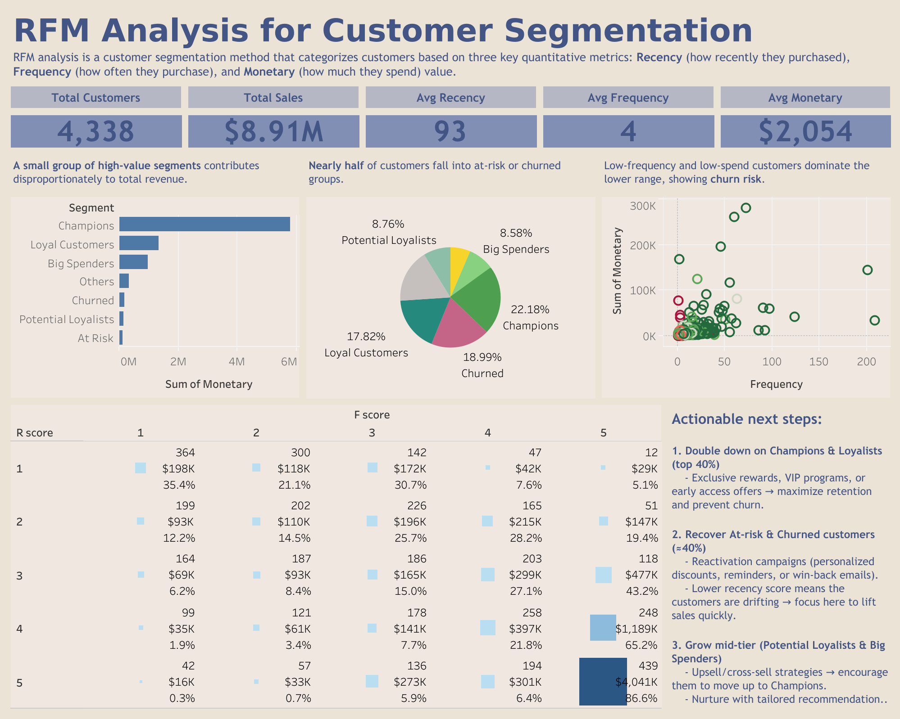
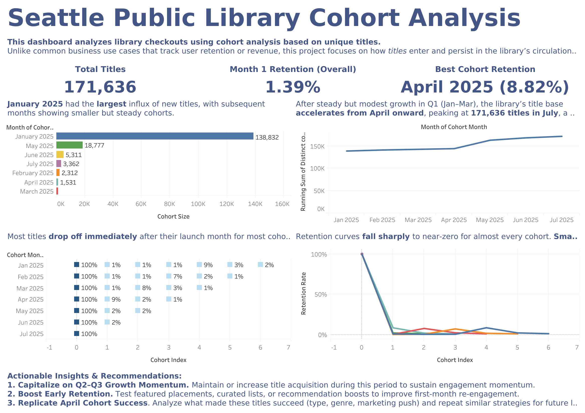
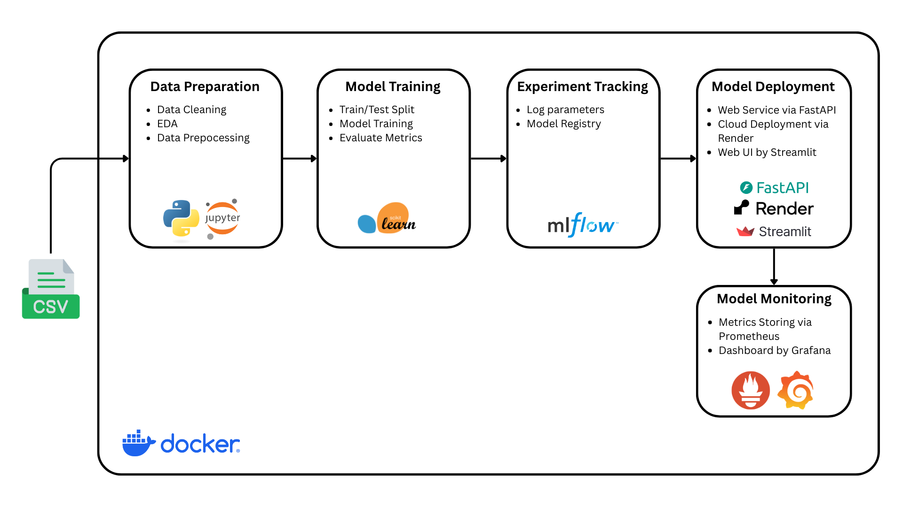
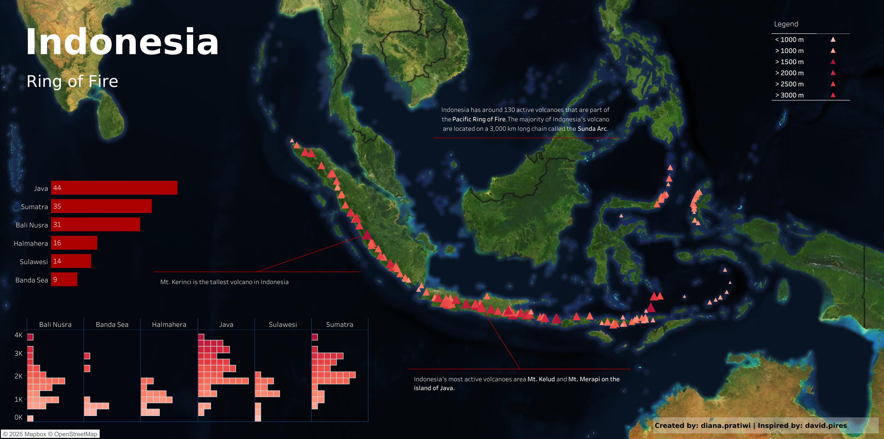
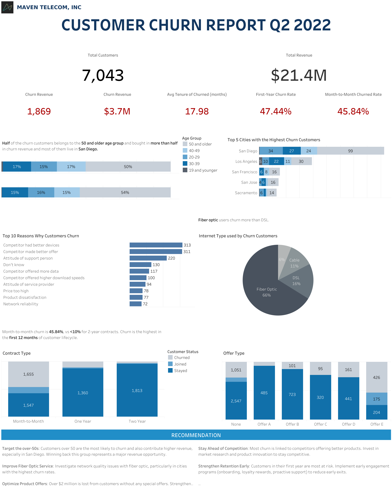
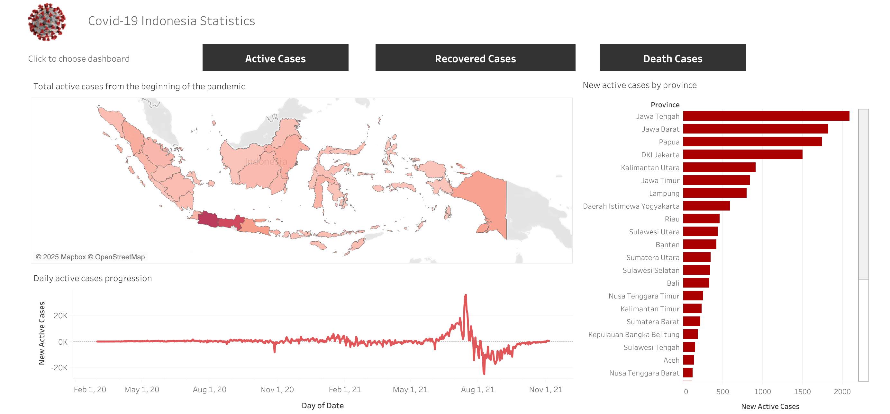
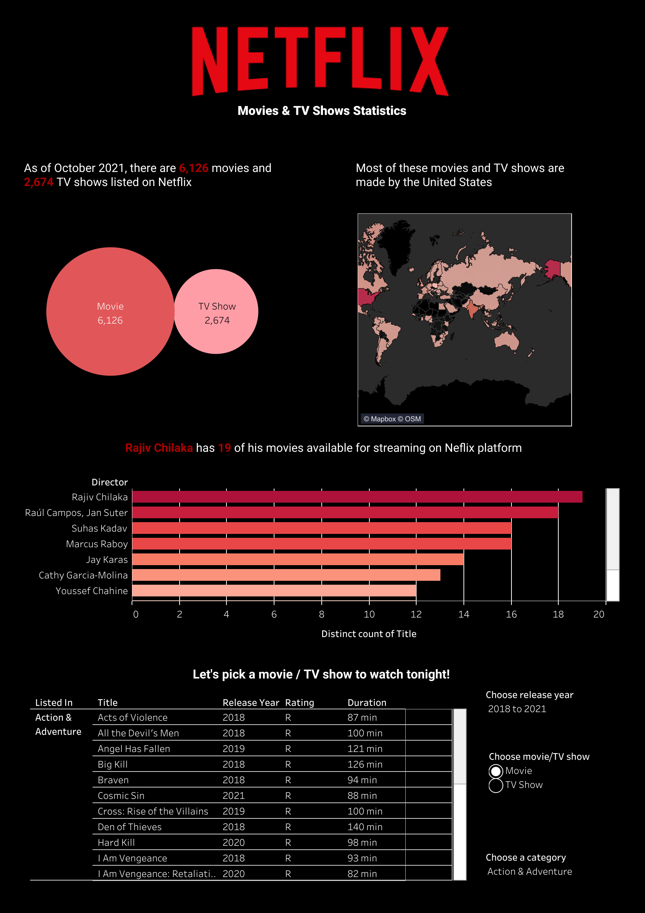

# 📊 Diana Pratiwi — Data Analyst Portfolio

Hi! I’m **Diana**, a data analyst who combines strong technical skills with business insight to turn data into actionable decisions.  
My work spans **SQL analytics**, **Python data projects**, and **interactive dashboards**, reflecting both my technical depth and practical storytelling ability.

---

## 🗂️ Table of Contents
1. [SQL Analytics](#-sql-analytics)
2. [Python Projects](#-python-projects)
3. [Dashboards](#-dashboards)
4. [Contact](#-contact)

---

## 🧠 SQL Analytics

Practical SQL case studies from the [8-Week SQL Challenge](https://8weeksqlchallenge.com/), covering complex joins, window functions, CTEs, and business analysis queries.

| Challenge | Description | Tools |
|------------|--------------|-------|
| 🍜 **Danny’s Diner** | Analyse customer visit patterns, spend and favourite menu items to inform a loyalty program and generate easy-to-inspect summary tables. | MySQL |
| 🍕 **Pizza Runner** | Clean and transform order & runner data to measure pizza/runner metrics (volumes, delivery performance, ingredient usage, pricing & profitability). | MySQL |
| 🥪 **Foodie-Fi** | Analyse subscription & churn behaviour, customer onboarding journeys, and build a payments table to model monthly/annual billing. | MySQL |
| 🏦 **Data Bank** | Calculate customer balances, node allocations and data-provisioning requirements (including monthly forecasts and an interest-based growth option). | MySQL |
| 🧺 **Data Mart** | Clean weekly sales data and perform before-and-after analysis to quantify the sales impact of a June 2020 sustainability change across regions/platforms/segments. | MySQL |
| 🦞 **Clique Bait** | Join user/events/campaign data to compute funnel fall-out, campaign performance, page event flows and conversion metrics. | MySQL |
| 🥾 **Balanced Tree Clothing Co.** | Analyse product-level sales and merchandising metrics to produce basic financial and sales performance reports for the merchandising team. | MySQL |
| 🍊 **Fresh Segments** | Analyse aggregated interest metrics and rankings to profile client customers’ interests and provide high-level marketing insights. | MySQL |

> 📁 Full SQL solutions are available in my **[SQL Challenges Repo](https://github.com/deedeepratiwi/8-week-sql-challenge)**

🔝[Back to top](#-table-of-contents)

---

## 🐍 Python Projects

End-to-end data projects covering analytics, data pipeline, and machine learning including MLOps workflows.  
Each project folder includes code, notebooks, and documentation.

### 📈 Analytics
- 🛒 **Online Retail RFM Analysis**
  
  Analyzes customer purchasing behavior using **RFM (Recency, Frequency, Monetary)** scoring to identify high-value and at-risk customers and optimize marketing strategies. The dashboard highlights revenue distribution across segments, customer mix, and behavioral patterns through bar charts, pie charts, scatterplots, and a heatmap. Python code can be found [here](https://github.com/deedeepratiwi/retail-rfm-analysis/blob/main/rfm_analysis.ipynb).
  
  
  
- 📚 **Seattle Public Library Cohort Analysis**
  
  Analyzes library title retention and longevity through **cohort analysis**. Instead of focusing on user churn, it tracks how new titles released each month perform over time — identifying when they drop off, which cohorts retain engagement the longest, and how total collection size evolves. Python code can be found [here](https://github.com/deedeepratiwi/seattle-public-library-cohort-analysis/blob/main/seattle_public_library_cohort_analysis.ipynb).

  

### 🔩 Data Pipeline
- 🎵 **Spotify Audio Features**

  Analyzed patterns in music characteristics using the Spotify Tracks dataset to understand how audio features such as danceability, energy, and valence evolved across time. The raw CSV data was ingested into PostgreSQL using **Python** and then transformed using **dbt** to create clean, analytics-ready models. **Prefect** was used for workflow orchestration to ensure repeatable data pipelines. The insights were visualized in an interactive **Tableau** dashboard highlighting long-term feature trends and distribution patterns. The entire pipeline was containerized with Docker Compose for reproducible local development, demonstrating end-to-end analytics engineering skills without yet requiring cloud deployment.
  Python code can be found [here](https://github.com/deedeepratiwi/spotify-analysis).
  
  
  
  
  
### 🤖 Machine Learning
- 🛍️ E-commerce Churn Prediction
  This project focuses on predicting customer churn for an e-commerce platform using structured behavioral and demographic data. I performed exploratory data analysis to understand key churn drivers, trained, and evaluated multiple models (Logistic Regression, Decision Tree, and Random Forest), and selected the best-performing pipeline based on accuracy and interpretability.
The final model was exported and deployed using **FastAPI**, containerized with **Docker**, and hosted on **Render**. I also integrated **Prometheus** and **Grafana** for real-time monitoring of API performance. To make the model accessible, I built a **Streamlit UI** that allows users to input customer details and receive churn predictions instantly.
The entire workflow is reproducible, version-controlled, and optimized for cost-effective cloud deployment — demonstrating end-to-end MLOps practices.
  Python code can be found [here](https://github.com/deedeepratiwi/ecommerce-churn-prediction).

  

- 🏨 **Hotel Booking Cancellation**
  
  An end-to-end MLOps pipeline that predicts hotel booking cancellations using the Hotel Booking Demand dataset. The project demonstrates the full machine learning lifecycle — from data preprocessing and model training with MLflow tracking, to serving the model via FastAPI, containerizing with Docker, and monitoring performance through Prometheus + Grafana.
  Python code can be found [here](https://github.com/deedeepratiwi/mlops-hotel-cancellation).

> 🧾 View all my Python repos [here on GitHub](https://github.com/deedeepratiwi?tab=repositories)

🔝[Back to top](#-table-of-contents)

---

## 📈 Dashboards

Interactive data visualizations and dashboards published on Tableau Public.

- 🌋 **Indonesia Ring of Fire**
  
  Visualizes the distribution and characteristics of Indonesia’s volcanoes — part of the Pacific “Ring of Fire”. Data was collected through a custom Python web scraper from Wikipedia, then cleaned in Microsoft Excel. Python code for web scraping can be found [here](https://github.com/deedeepratiwi/web-scraping-indonesia-volcano/blob/main/Web_Scraping_Indonesia_Volcano.ipynb).
  
  
  
- 🛰️ **Maven Telecom Customer Churn Analysis**
  
  Examined telecom customer churn drivers by contract type, tenure, and service features to identify key retention opportunities and improve subscription longevity.
  
  
  
- 🦠 **Covid-19**
  
  Visualized Indonesian COVID-19 active, recovered, and deaths cases based on [Kaggle](https://www.kaggle.com/datasets/hendratno/covid19-indonesia) dataset to see the spread of the disease overtime on every provinces.
  
  
  
- 🎥 **Neflix**
  
  Analyzed the Netflix catalog by genre, release year, and country distribution to uncover trends in content diversity, regional focus, and production evolution over time.
  
  

> 🔗 Explore all dashboards on [my Tableau Public profile](https://public.tableau.com/app/profile/diana.pratiwi/vizzes)

🔝[Back to top](#-table-of-contents)

---

## 💬 Contact

📧 **Email:** [deedeepratiwi@gmail.com](mailto:deedeepratiwi@gmail.com)  
💼 **LinkedIn:** [linkedin.com/in/deedeepratiwi](https://linkedin.com/in/deedeepratiwi)  
📍 **Location:** Jakarta, Indonesia (open to remote roles in AU/EU time zones)

---

## 🪶 Quote

> “Data tells a story — I make sure it’s one worth listening to.”
